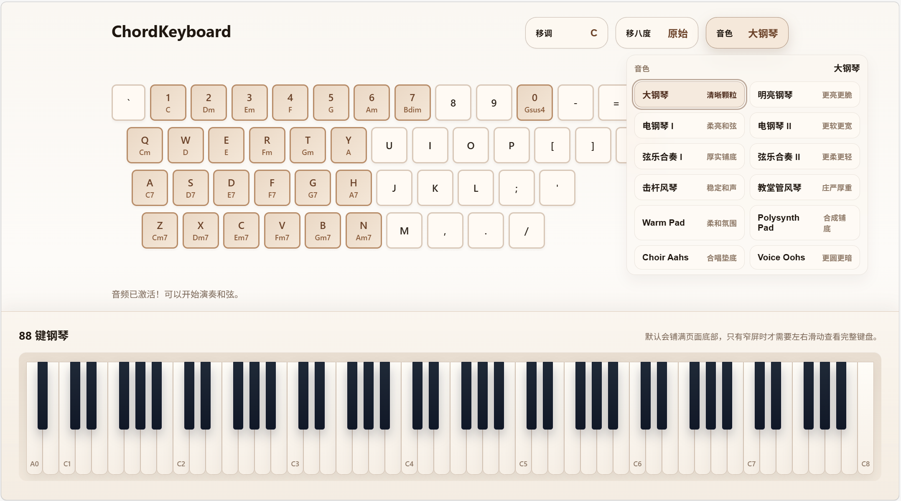
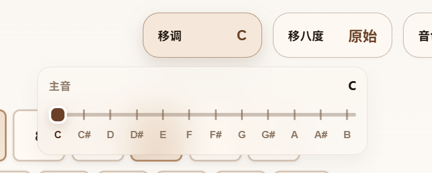

# ChordKeyboard

> English version is available below.

ChordKeyboard 是一个在浏览器中运行的和弦演奏工具，面向首调唱名和快速和声试奏场景。它允许你直接使用电脑键盘触发预设和弦，并在页面底部提供 88 键钢琴的演奏实时可视化。

## 音域和移调

页面顶部提供了两个独立的离散控制：`移调` 和 `移八度`。它们默认只显示当前状态，点击后会以悬浮面板的形式展开，不会把下方的电脑键盘区域挤到更低的位置。

- `移调` 用于改变所有和弦的主音。按钮会直接显示当前调性，例如 `C`、`F#`、`Bb`。
- `移八度` 用于整体抬高或降低演奏音区。目前提供 4 个固定档位：`低两个八度`、`低一个八度`、`原始`、`高一个八度`。
- 这两个控制都是离散式的：既可以直接点击刻度，也可以拖动滑块在固定档位之间切换。
- 如果在按住和弦时调整 `移调` 或 `移八度`，当前发声会立即按新的设置重播，同时底部 88 键钢琴的按下状态也会同步刷新。
- 除了顶部的 `移八度` 控件，还可以使用方向键进行临时音域偏移：`ArrowUp` 临时升高一个八度，`ArrowDown` 临时降低一个八度，松开后恢复到当前设置的音域。

## 音色

当前内置的可选音色分为几类：

- 钢琴类：`大钢琴`、`明亮钢琴`、`电钢琴 I`、`电钢琴 II`
- 弦乐类：`弦乐合奏 I`、`弦乐合奏 II`
- 风琴类：`击杆风琴`、`教堂管风琴`
- 合成铺底：`Warm Pad`、`Polysynth Pad`
- 人声类：`Choir Aahs`、`Voice Oohs`

实际 SoundFont 资源会在切换到对应音色时按需加载，并在内存中缓存，因此增加音色选项本身不会明显增大项目体积。

## 键位说明

页面上方会显示完整的电脑键盘映射。常用主和弦入口如下：

- `1` -> `C`
- `2` -> `Dm`
- `3` -> `Em`
- `4` -> `F`
- `5` -> `G`
- `6` -> `Am`
- `7` -> `Bdim`
- `0` -> `Gsus4`

其余小和弦、七和弦和扩展和弦请以页面上的键盘标注为准。

额外控制：

- `ArrowUp`：临时升高一个八度
- `ArrowDown`：临时降低一个八度
- 松开方向键后恢复当前设置的音域

## 音源说明

- 默认使用 [`soundfont-player`](https://github.com/danigb/soundfont-player)
- SoundFont 成功加载时，会使用对应乐器采样播放
- 如果浏览器、网络或第三方脚本加载失败，则自动回退到基于 Web Audio 的合成音色

## 使用方法

1. 直接在浏览器中打开 [index.html](index.html)
2. 点击页面任意位置以激活音频上下文
3. 在顶部调整 `移调`、`移八度` 和 `音色`
4. 按下页面标注的电脑键盘键位演奏和弦

这个项目是纯前端静态页面，不需要构建步骤，也不依赖本地服务器。

项目文件：

- [index.html](index.html)：页面结构与控制面板
- [styles.css](styles.css)：整体样式、固定底部钢琴与浮层样式
- [main.js](main.js)：键位映射、音频播放逻辑、钢琴联动和音色控制

---

## English Version

ChordKeyboard is a browser-based chord-playing tool for movable-do practice and quick harmony sketching. It lets you trigger preset chords from your computer keyboard and provides a real-time 88-key piano visualization at the bottom of the page.

## Range And Transposition

At the top of the page there are two independent discrete controls: `Transposition` and `Octave Shift`. By default they only show the current state. When clicked, they open as floating panels, so the computer-keyboard area below keeps its position.

- `Transposition` changes the tonic for all chords globally. The trigger button always shows the current key, such as `C`, `F#`, or `Bb`.
- `Octave Shift` moves the entire playable register up or down. There are 4 fixed steps: `Down 2`, `Down 1`, `Original`, and `Up 1`.
- Both controls are discrete rather than continuous: you can click the ticks directly or drag the slider between fixed positions.
- If you adjust `Transposition` or `Octave Shift` while holding chords, the current sound is replayed immediately using the new setting, and the bottom 88-key piano visualization updates at the same time.
- In addition to the top `Octave Shift` control, you can use the keyboard for temporary register offsets: `ArrowUp` raises by one octave and `ArrowDown` lowers by one octave until the key is released.

## Voices

Built-in voice options currently include:

- Piano: `Grand Piano`, `Bright Piano`, `Electric Piano I`, `Electric Piano II`
- Strings: `String Ensemble I`, `String Ensemble II`
- Organ: `Drawbar Organ`, `Church Organ`
- Pads: `Warm Pad`, `Polysynth Pad`
- Voices: `Choir Aahs`, `Voice Oohs`

Actual SoundFont assets are loaded on demand when a voice is selected and then cached in memory, so adding more voice options does not significantly increase the project size by itself.

## Key Controls

The full keyboard mapping is shown on screen. Common root-chord entries include:

- `1` -> `C`
- `2` -> `Dm`
- `3` -> `Em`
- `4` -> `F`
- `5` -> `G`
- `6` -> `Am`
- `7` -> `Bdim`
- `0` -> `Gsus4`

For minor variants, sevenths, and extended chords, please refer to the labels shown directly on the page.

Additional controls:

- `ArrowUp`: temporary octave up
- `ArrowDown`: temporary octave down
- Releasing the arrow key restores the current configured range

## Audio Source

- Default audio source: [`soundfont-player`](https://github.com/danigb/soundfont-player)
- If SoundFont loads successfully, sampled instruments are used
- If the browser, network, or third-party script fails to load, playback falls back to synthesized Web Audio voices

## How To Use

1. Open [index.html](index.html) directly in a browser
2. Click anywhere on the page once to unlock the audio context
3. Adjust `Transposition`, `Octave Shift`, and `Voice` from the top controls
4. Press the labeled computer-keyboard keys to play chords

This is a static frontend project. No build step or local server is required.

Project files:

- [index.html](index.html): page structure and control panels
- [styles.css](styles.css): visual styles, fixed bottom piano, and floating panels
- [main.js](main.js): key mapping, audio playback logic, piano sync, and voice control
