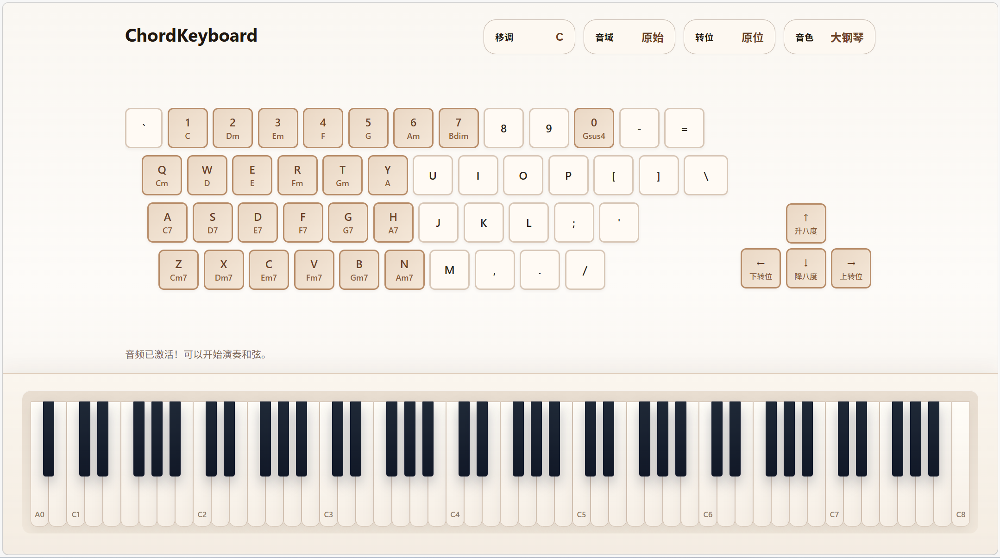

# ChordKeyboard

> English version is available below.

ChordKeyboard 是在浏览器中运行的和弦演奏工具，使用电脑键盘控制，以首调唱名法演奏对应调式的和弦。

## 音域和移调

页面顶部提供了三个独立的离散控制：`移调`、`音域` 和 `转位`。

- `移调` 用于改变所有和弦的主音。按钮会直接显示当前调性，例如 `C`、`F#`、`Bb`。
- `音域` 用于整体抬高或降低演奏音区。目前提供 4 个固定档位：`低两个八度`、`低一个八度`、`原始`、`高一个八度`。
- `转位` 用于设置默认和弦排列方式，目前提供 3 个模式：`原位`、`第一转位`、`第二转位`。
- 临时音域偏移：`ArrowUp` 临时升高一个八度，`ArrowDown` 临时降低一个八度，松开后恢复到当前设置的音域。
- 临时和弦转位：`ArrowRight` 会基于当前转位状态再做一次上转位，把当前最低音移到最上方；`ArrowLeft` 会基于当前转位状态再做一次下转位，把当前最高的和声音移到最下方。对于七和弦，如果被转位的是五音，则七音也会跟随做同方向转位。松开后会回到当前按钮设置的转位模式。

## 音色

当前内置的可选音色分为几类：

- 钢琴类：`大钢琴`、`明亮钢琴`、`电钢琴 I`、`电钢琴 II`
- 弦乐类：`弦乐合奏 I`、`弦乐合奏 II`
- 风琴类：`击杆风琴`、`教堂管风琴`
- 合成铺底：`Warm Pad`、`Polysynth Pad`
- 人声 / 独奏类：`Choir Aahs`、`Cello`、`French Horn`、`Clarinet`

实际 SoundFont 资源会在切换到对应音色时按需加载，并在内存中缓存。

## 键位说明

页面上方计算机键盘区完整展示了作者设计的键盘和弦映射。如：

- `1` -> `C`
- `2` -> `Dm`
- `3` -> `Em`
- `4` -> `F`
- `5` -> `G`
- `6` -> `Am`
- `7` -> `Bdim`
- `0` -> `Gsus4`

其余和弦以页面上的键盘标注为准。

额外控制：

- `ArrowUp`：临时升高一个八度
- `ArrowDown`：临时降低一个八度
- `ArrowRight`：基于当前转位临时再上转一次，把当前最低音移到最上面
- `ArrowLeft`：基于当前转位临时再下转一次，把当前最高的和声音移到最下面；七和弦中若五音被转下去，七音也会一起下行
- 松开方向键后恢复当前设置的音域和转位

## 音源说明

- 默认使用 [`soundfont-player`](https://github.com/danigb/soundfont-player): https://github.com/danigb/soundfont-player
- SoundFont 成功加载时，会使用对应乐器采样播放
- 如果浏览器、网络或第三方脚本加载失败，则自动回退到基于 Web Audio 的合成音色

## 使用方法

1. 直接在浏览器中打开 [index.html](index.html)
2. 点击页面任意位置以激活音频上下文
3. 在顶部调整 `移调`、`音域`、`转位` 和 `音色`
4. 按下实体电脑键盘，或直接点击页面上的电脑键盘按键来演奏和弦

这个项目是纯前端静态页面，不需要构建步骤，也不依赖本地服务器。

项目文件：

- [index.html](index.html)：页面结构与控制面板
- [styles.css](styles.css)：整体样式、固定底部钢琴与浮层样式
- [main.js](main.js)：键位映射、音频播放逻辑、钢琴联动和音色控制

---

## English Version

ChordKeyboard is a browser-based chord-playing tool, controlled by computer keyboard for playing chords based on movable-do system.

## Range And Transposition

At the top of the page there are three independent discrete controls: `Transposition`, `Octave Shift`, and `Inversion`.

- `Transposition` changes the tonic for all chords globally. The trigger button always shows the current key, such as `C`, `F#`, or `Bb`.
- `Octave Shift` moves the entire playable register up or down. There are 4 fixed steps: `Down 2`, `Down 1`, `Original`, and `Up 1`.
- `Inversion` sets the default chord voicing, with 3 modes: `Root Position`, `First Inversion`, and `Second Inversion`.
- In addition to the top `Octave Shift` control, you can use the keyboard for temporary register offsets: `ArrowUp` raises by one octave and `ArrowDown` lowers by one octave until the key is released.
- Temporary relative inversions are also supported: `ArrowRight` applies one additional upward inversion on top of the current voicing, moving the current lowest note to the top, while `ArrowLeft` applies one additional downward inversion, moving the current highest chord tone to the bottom. In seventh chords, if the fifth is the note being inverted, the seventh follows in the same direction; otherwise a top seventh stays in place and the next-highest chord tone moves instead. Releasing the key returns to the configured inversion mode.

## Voices

Built-in voice options currently include:

- Piano: `Grand Piano`, `Bright Piano`, `Electric Piano I`, `Electric Piano II`
- Strings: `String Ensemble I`, `String Ensemble II`
- Organ: `Drawbar Organ`, `Church Organ`
- Pads: `Warm Pad`, `Polysynth Pad`
- Voices: `Choir Aahs`, `Cello`, `French Horn`, `Clarinet`

Actual SoundFont assets are loaded on demand when a voice is selected and then cached in memory.

## Key Controls

The full keyboard mapping is shown on screen. Common root-chord entries include:

- `1` -> `C`
- `2` -> `Dm`
- `3` -> `Em`
- `4` -> `F`
- `5` -> `G`
- `6` -> `Am`
- `7` -> `Bdim`
- `0` -> `Gsus4`

For minor variants, sevenths, and extended chords, please refer to the labels shown directly on the page.

Additional controls:

- `ArrowUp`: temporary octave up
- `ArrowDown`: temporary octave down
- `ArrowRight`: apply one additional temporary upward inversion from the current voicing, moving the current lowest note to the top
- `ArrowLeft`: apply one additional temporary downward inversion from the current voicing; in seventh chords, if the fifth moves down, the seventh follows in the same direction
- Releasing the arrow key restores the current configured range and inversion

## Audio Source

- Default audio source: [`soundfont-player`](https://github.com/danigb/soundfont-player)
- If SoundFont loads successfully, sampled instruments are used
- If the browser, network, or third-party script fails to load, playback falls back to synthesized Web Audio voices

## How To Use

1. Open [index.html](index.html) directly in a browser
2. Click anywhere on the page once to unlock the audio context
3. Adjust `Transposition`, `Octave Shift`, `Inversion`, and `Voice` from the top controls
4. Play chords by pressing the physical keyboard or clicking the on-screen computer-keyboard keys

This is a static frontend project. No build step or local server is required.

Project files:

- [index.html](index.html): page structure and control panels
- [styles.css](styles.css): visual styles, fixed bottom piano, and floating panels
- [main.js](main.js): key mapping, audio playback logic, piano sync, and voice control
